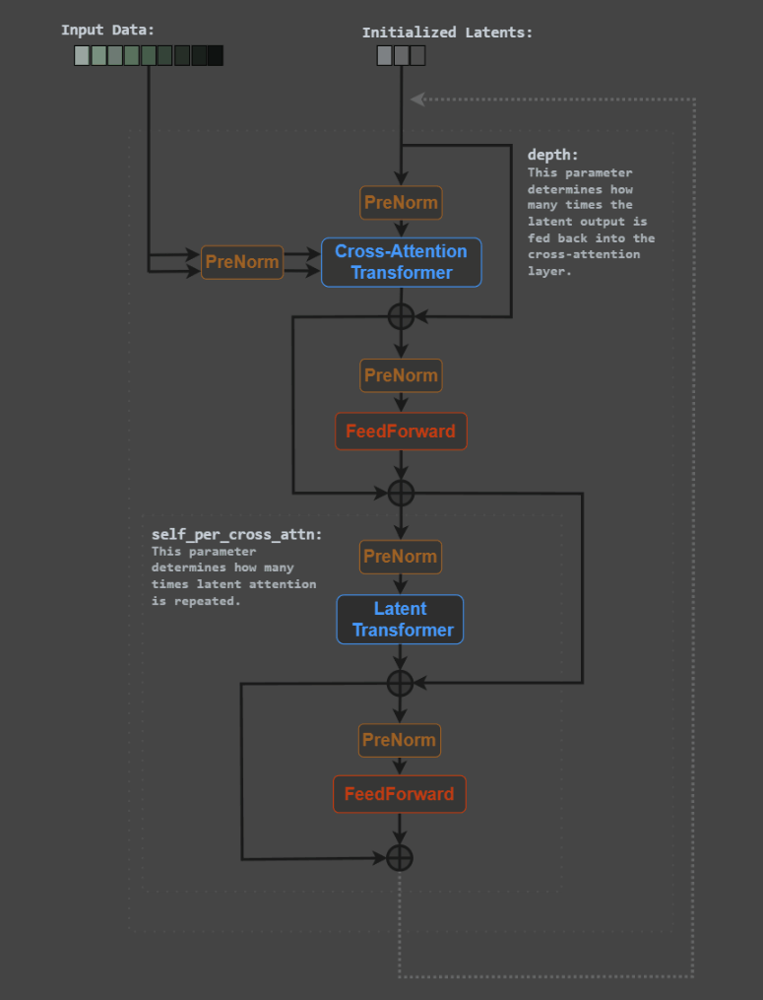

# PERCEIVER: General Perception with Iterative Attention

This repository contains the implementations in PyTorch of the Perceiver model from the paper [Perceiver: General Perception with Iterative Attention](https://arxiv.org/abs/2103.03206).

# Structure of the repository
- datasets: contains the folder of the dataset used in the experiments
- image: contains the schematic representation of the Perceiver model
- paper: all papers used in the project
- src: contains the implementation of the Perceiver model
- train: contains the training script of the Perceiver model
- test: contains the unittest of the Perceiver model

